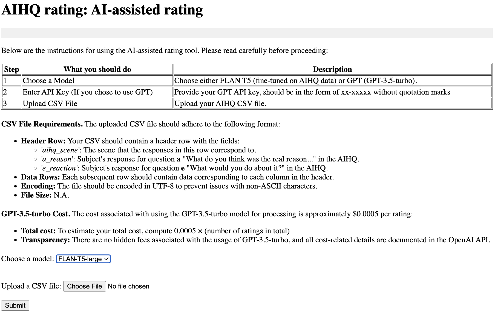

Installation
===============================

Recommended Python Version: **3.11.3**

Here’s what the website looks like after installation:

After successfully setting up the AIHQ Rating Website, you’ll see an interface like this:



The above image shows the main page of the AIHQ Rating Website, where you can start by selecting a model and uploading your CSV file for rating.

Setup Instructions:

1. **Download the Website Folder**:

   - Go to the repository page where the website code is hosted: `AIHQ Rating <https://github.com/lyulouisa/Website_AIHQ_rating.git>`__

   - In the upper right corner of the page, look for the following button:

     .. raw:: html

        <span style="background-color:#d4edda; padding: 4px; font-weight: bold;">&lt;&gt;Code</span>

   - Click the **<>Code** button, and from the dropdown menu, select **"Download ZIP"**. This will download a ZIP file of the website folder onto your computer.

2. **Extract the ZIP File**:

   - After the ZIP file finishes downloading, locate it in your computer’s Downloads folder (or wherever your files are set to be saved).
   - Right-click on the ZIP file and select **"Extract All"** (Windows) or **"Open with > Archive Utility"** (Mac) to unzip the folder.

3. **Open the Command Line (Terminal)**:

   - **Windows**: Press the **Windows Key** on your keyboard, type "cmd", and press **Enter** to open the Command Prompt.
   - **Mac**: Press **Command (⌘) + Space**, type "Terminal", and press **Enter** to open the Terminal.

4. **Navigate to the Website Folder**:

   - In the command line window, type the following command and press **Enter**:
   
     ```
     cd /path/to/this/website/folder
     ```

   - Replace `/path/to/this/website/folder` with the actual location of the folder where you unzipped the files.

5. **Run the Website Script**:

   - In the same command line window, type the following command and press **Enter**:
   
     ```
     python main.py
     ```

6. **Access the Website**:

   - Once the installation is complete, open **Google Chrome** or another browser and copy the link shown in the terminal (something like `http://127.0.0.1:5005`) to access the website.

