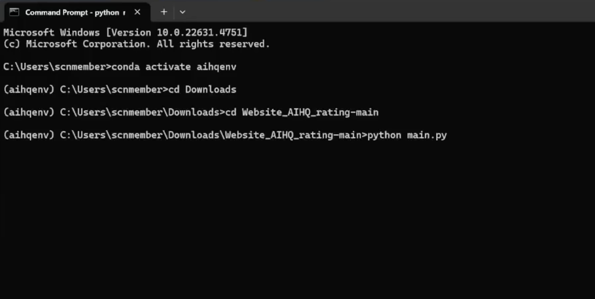

Local Installation: Windows
==============================

1. Prepare Python Environment
-----------------------------

You will first install Miniconda, then create a Python 3.11.3 virtual environment.

Step 1: Install Miniconda
~~~~~~~~~~~~~~~~~~~~~~~~~

1. Download the correct installer for your PC:

   - Windows (x86_64):
     https://repo.anaconda.com/miniconda/Miniconda3-latest-Windows-x86_64.exe

2. Open Command Prompt:

   - Press the **Windows key**, type **cmd**, and press **Enter**

3. Run the installer for Miniconda:

   - Windows (x86_64): ::

       Miniconda3-latest-Windows-x86_64.exe

     - Follow the prompts and agree to the license terms.
     - Allow the installer to initialize Miniconda (it will add itself to your system’s PATH).

4. Restart Command Prompt and verify installation.

   - Open Command Prompt:

     - Press the **Windows key**, type **cmd**, and press **Enter**

   - In the command prompt window, type ::

       conda --version

   - You should see the conda version displayed. If not, check your PATH settings.

Step 2: Create and Activate a Python 3.11.3 Virtual Environment
~~~~~~~~~~~~~~~~~~~~~~~~~~~~~~~~~~~~~~~~~~~~~~~~~~~~~~~~~~~~~~~

1. Open Command Prompt (see Step 1.2).

2. Create a new Python 3.11.3 conda environment by typing the following into the prompt: ::

       conda create -n aihqenv python=3.11.3

   *Note that aihqenv is the name of your environment. You can replace it with any name of your choosing.*

3. Activate the environment: ::

       conda activate aihqenv

   Your prompt should now show ``(aihqenv)`` to indicate the environment is active.

2. Install automated-AIHQ
-------------------------

Step 1: Download the automated-AIHQ
~~~~~~~~~~~~~~~~~~~~~~~~~~~~~~~~~~~

1. Visit the repository page: https://github.com/lyulouisa/Website_AIHQ_rating

   - At the top-right area of the page, just above the list of files, you’ll see a green button labeled

     .. raw:: html

        &lt;&gt;Code

   - Click the **<> Code** button, and in the menu that appears, choose **“Download ZIP.”** This will download a ZIP file of the website folder onto your computer with the name “Website_AIHQ_rating-main.zip”

2. Extract the ZIP file:

   - Once the ZIP file finishes downloading, open your Downloads folder (or wherever your browser saves files).
   - Look for a file named Website_AIHQ_rating-main.zip.
   - Right-click the ZIP file and select **Extract All…**.  
   - You should now see a folder called Website_AIHQ_rating-main. This is the automated-AIHQ tool.

3. Download the fine-tuned Flan-T5-large model (you can ignore this step if you do not intend to use this model)

   - There are three options to download the model:

     i.  **Zenodo:** https://zenodo.org/records/16730672 (download the zipped folder)  
     ii. **Dropbox:** https://www.dropbox.com/scl/fi/8knvlq83r9j031axqiqq7/AIHQ_rating.zip?dl=0  
     iii. **Hugging Face:** https://huggingface.co/lyulouisaa/flant5-finetuned-aihqrating  
          You will need to download each file directly and save it in a folder titled: ``flant5-large-finetuned``

   - Once the download is complete, click **Extract all** to unzip. You should see a folder named ``flant5-large-finetuned``

4. Place the folder in the Website_AIHQ_rating folder:

   - Drag the ``flant5-large-finetuned`` folder into the ``Website_AIHQ_rating-main`` folder.
   - When you are done, your folder structure should look like:

5. Open Command Prompt:

   - Press the **Windows key**, type **cmd**, and press **Enter** to open Command Prompt
   - Navigate to the automated-AIHQ folder:  

     - In the command line window, type ``cd \path\to\Website_AIHQ_rating-main`` and press **Enter**  
     - Replace ``\path\to\Website_AIHQ_rating-main`` with the location of the folder where you unzipped the files.

6. Run the script:

   - In the same command line window, type ``python main.py`` and press **Enter**

7. Access the automated-AIHQ interface:

   - Once the installation is complete, the command line will display a link, e.g.,

     .. raw:: html

        

          <a href="http://127.0.0.1:5005" style="color:red; text-decoration:underline;">http://127.0.0.1:5005</a>
        

   - Open this link in your web browser. The automated-AIHQ interface will appear.

Launching Automated-AIHQ after successful installation
------------------------------------------------------

If you have already installed the tool, you just need to follow the following steps to open the tool.

1. Open Command Prompt:

   - Press the **Windows key**, type **cmd**, and press **Enter** to open Command Prompt
   - Navigate to the automated-AIHQ folder:  

     - In the command line window, type ``cd \path\to\Website_AIHQ_rating-main`` and press **Enter** 
     - Replace ``\path\to\Website_AIHQ_rating-main`` with the location of the folder where you unzipped the files.

2. Run the script:

   - In the same command line window, type ``python main.py`` and press **Enter**

3. Access the automated-AIHQ interface:

   - Once the installation is complete, the command line will display a link, e.g.,

     .. raw:: html

        

          <a href="http://127.0.0.1:5005" style="color:red; text-decoration:underline;">http://127.0.0.1:5005</a>
        

   - Open this link in your web browser. The automated-AIHQ interface will appear.

Troubleshooting
---------------

1. Version mismatch (NumPy/Pandas) error when running ``python main.py``: This is typically due to incompatible package versions. The included ``installation.py`` pins:

   - pandas==1.5.3  
   - numpy==1.24.3  

   If you still encounter errors, ensure you’re inside the ``aihqenv`` environment and then run: ::

       python -V

   Confirm it shows Python 3.11.3. Next, reinstall the pinned packages: ::

       python -m pip uninstall -y pandas
       python -m pip install pandas==1.5.3
       python -m pip install numpy==1.24.3

   Then try ::

       python main.py

2. Model folder not found:

   Double-check that ``flant5-large-finetuned`` is inside your website folder, e.g.:

   ::

     Website_AIHQ_rating-main\flant5-large-finetuned

Video
---------------

Click here for a `video <https://youtu.be/g_sI8MOr_lk>`__ showing you how to showing you how to install automated-AIHQ on your PC step by step. 
